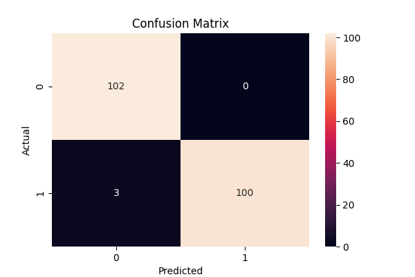
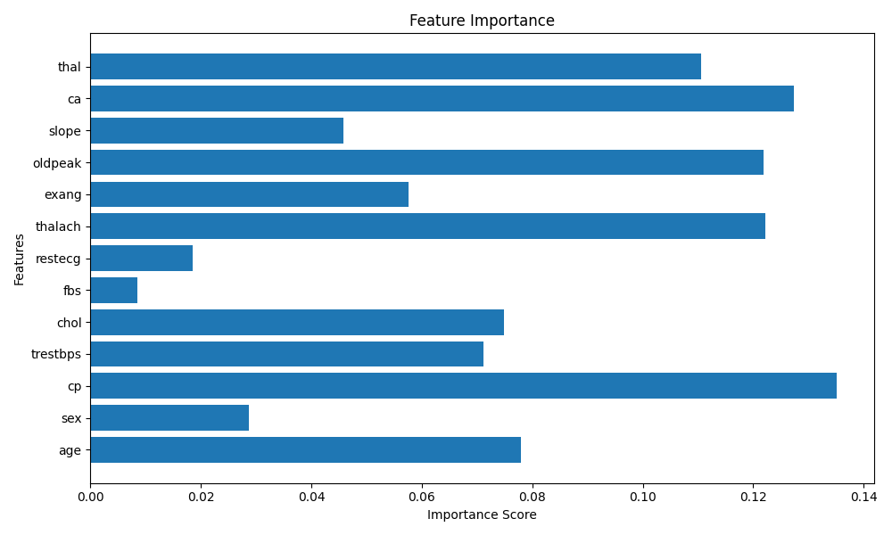

# Disease Prediction Using Machine Learning

## Overview

This project predicts the likelihood of heart disease using patient medical data and machine learning.

## Dataset

* Heart Disease Dataset
* 1025 patient records
* 13 medical features
* Dataset Source: UCI Heart Disease Dataset

## Features Used

* Age
* Sex
* Chest Pain Type
* Blood Pressure
* Cholesterol
* Fasting Blood Sugar
* ECG Results
* Maximum Heart Rate
* Exercise-Induced Angina
* Oldpeak
* Slope
* Number of Major Vessels
* Thalassemia

## Machine Learning Algorithm

Random Forest Classifier

## Project Workflow

1. Data Loading
2. Data Cleaning
3. Train-Test Split
4. Model Training
5. Model Evaluation
6. Model Saving

## Results

* Accuracy: 98.54%
* Disease Prediction Successfully Implemented

## Model Performance

- Accuracy: 98.54%
- Precision: 1.00 (Heart Disease)
- Recall: 0.97 (Heart Disease)
- F1-Score: 0.99

The model correctly classified 202 out of 205 test samples.

## Confusion Matrix



## Feature Importance



## Technologies Used

* Python
* Pandas
* NumPy
* Scikit-learn

## Future Improvements

- Deploy using Streamlit
- Build a web-based prediction interface
- Compare multiple machine learning algorithms
- Add real-time patient input
- Improve model generalization with larger datasets

## Installation

```bash
pip install pandas numpy scikit-learn matplotlib seaborn
```

## Run the Project

```bash
python disease_prediction.py
```

## Project Highlights

- Dataset Size: 1025 records
- Features Used: 13
- Algorithm: Random Forest Classifier
- Accuracy Achieved: 98.54%
- Model Saved Using Pickle
- Confusion Matrix Visualization
- Feature Importance Analysis

## Author

Anubhab Pal

CodeAlpha Machine Learning Internship Project
